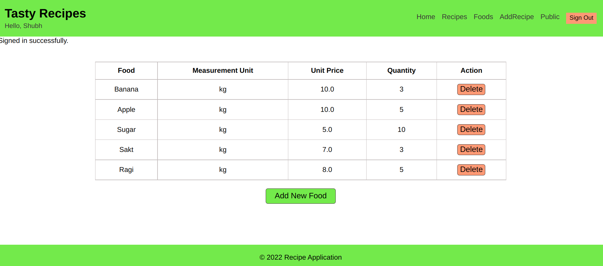

## Recipe App
The Recipe app keeps track of all your recipes, ingredients, and inventory. It will allow you to save ingredients, keep track of what you have, what needs to buy, and generate a shopping list based on what you have and what you are missing from a recipe. Also, since sharing recipes is an important part of cooking the app should allow you to make them public so anyone can access them.

## Screenshots


 

## Built With

- Technologies used:
  - Ruby
  - Rails
  - css
  - postgresql


## Getting Started

### Prerequisites

You need to have a browser and this tools installed:

- Git
- Ruby
- MVC patterns

### Setup

To get a local copy up and running follow these simple example steps:

```
$ git clone https://github.com/Shubh-Dev/recipe-application.git
```

```
$ cd recipe-application
```

```
$ bundle install
```

### Usage

To run the server:

```
$ rails s
```

## Author

👤 <a href="https://github.com/Shubh-Dev" target="blank"></a> **Shubh-Dev**

- GitHub: [@Shubh-dev](https://github.com/Shubh-Dev)
- LinkedIn: [Shubh Dev](https://www.linkedin.com/in/shubhscb/)

## Acknowledgement
- Hat tip to anyone whose code was used
- Inspiration
- etc

## style check
- npx stylelint "**/*.{css,scss}"

## 🤝 Contributing

Contributions, issues, and feature requests are welcome!

This project is [MIT](./LICENSE.md) licensed.


